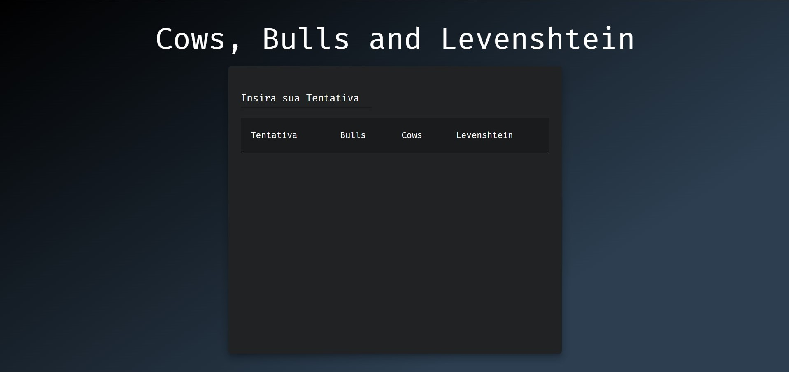
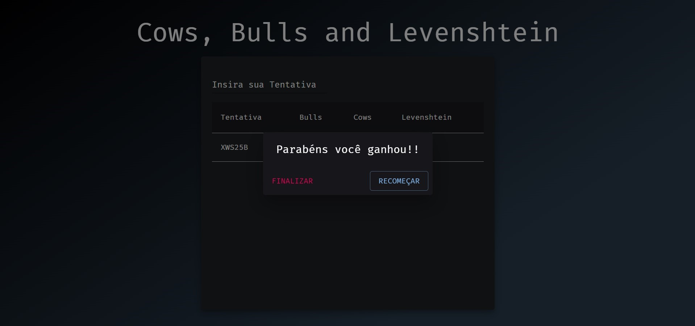
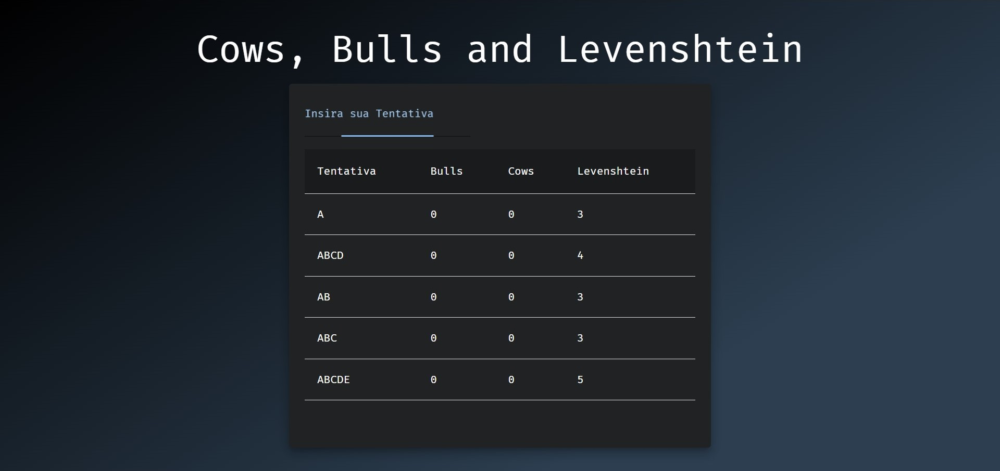

# Cows, Bulls and Levenshtein

**Número da Lista**: 20

**Conteúdo da Disciplina**: PD

## Alunos

| Matrícula  | Aluno                           |
| ---------- | ------------------------------- |
| 18/0054848 | Rhuan Carlos Pereira de Queiroz |
| 18/0028308 | Thiago Guilherme Muniz Ferreira |

## Sobre

A aplicação consiste num jogo inspirado no clássico jogo Cows and Bulls, mas desta vez propusemos um **desafio** (quer moleza vá jogar o campo minado com 4 bombas apenas) ao usuário, que ele deve adivinhar uma string alfanumérica aleatória
de tamanho variável de 1 a 8. Para isso daremos também a distância de Levenshtein em relação a string correta. Use com sabedoria!!

## Screenshots

## Instalação

**Linguagem**: Javascript

**Framework**: React.js

Instale as dependências do projeto usando o npm ou yarn:
`npm install` ou `yarn`

Inicie o servidor local:
`npm start` ou `yarn start`

## Uso

Abra navegador em `localhost:3000`

## Outros

Caso queira diminuir a dificuldade, altere a constante `SECRET_MAX_SIZE` para um valor menor.

## Vídeo
